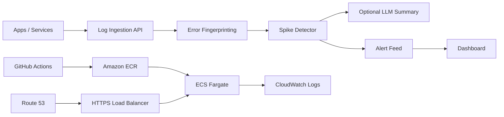

# Cloud-Native Log Analyzer With AI Alerting

TraceLens Logs is a cloud-native log analyzer that receives logs, groups similar errors, detects error spikes, and creates root-cause summaries with an optional LLM API.

The project is intentionally practical: it feels like a small observability platform, but the internals are still simple enough to explain in an interview.

## Features

- Log ingestion API for app/service logs
- Similar-error grouping using normalized fingerprints
- Error spike detection with growth percentage
- Alert feed with root-cause summary
- Optional LLM API integration for concise SRE-style summaries
- Local fallback summary when no LLM key is configured
- Dark modern dashboard with log stream, trend view, alert cards, and demo spike generator
- Dockerized app with health check
- GitHub Actions pipeline for validation, image push, and ECS redeploy
- Terraform infrastructure for AWS ECS Fargate, ECR, ALB, ACM, Route 53, and CloudWatch Logs
- Custom domain support, for example `logs.yourdomain.com`

## Architecture



## Run Locally

```bash
npm run check
npm start
```

Open:

```text
http://localhost:8090
```

If port `8090` is already busy, run with another port:

```powershell
$env:PORT="18090"; npm start
```

Docker:

```bash
docker compose up --build
```

If your Docker installation uses the older command, run `docker-compose up --build`.

With an LLM API key:

```bash
LLM_API_KEY=YOUR_KEY docker compose up --build
```

Demo flow:

1. Open the dashboard.
2. Click `Generate Spike`.
3. The app inserts several similar HTTP 500 logs.
4. The analyzer groups them and creates an alert.
5. If `LLM_API_KEY` is set, the summary comes from the model. Otherwise, a fallback summary is generated locally.

Example output:

```text
500 errors increased by 300%.
Likely cause: Database connection pool exhausted.
Recommended action: Increase pool limits carefully, close leaked connections, and check slow queries.
```

## Environment Variables

| Variable | Purpose | Default |
| --- | --- | --- |
| `PORT` | App port | `8090` |
| `DATA_DIR` | Persistent JSON store directory | `./data` |
| `ALERT_THRESHOLD_COUNT` | Logs needed in the current window before alerting | `6` |
| `ALERT_GROWTH_PERCENT` | Spike growth needed before alerting | `250` |
| `ALERT_WEBHOOK_URL` | Optional webhook for alerts | empty |
| `LLM_API_KEY` | Optional LLM API key | empty |
| `LLM_API_URL` | OpenAI-compatible chat completions endpoint | `https://api.openai.com/v1/chat/completions` |
| `LLM_MODEL` | Model name | `gpt-4o-mini` |

## API Examples

Send one log:

```bash
curl -X POST http://localhost:8090/api/logs \
  -H "content-type: application/json" \
  -d '{
    "service": "orders-api",
    "level": "error",
    "statusCode": 500,
    "message": "HTTP 500: database connection pool exhausted after waiting 3000ms for tenant 7129",
    "metadata": { "region": "ap-south-1" }
  }'
```

Generate a demo spike:

```bash
curl -X POST http://localhost:8090/api/demo/spike
```

## Upload To GitHub

Create a new GitHub repository named `log-analyzer-ai-alerting`, then run:

```bash
git init
git add .
git commit -m "Initial log analyzer with AI alerting"
git branch -M main
git remote add origin https://github.com/YOUR_USERNAME/log-analyzer-ai-alerting.git
git push -u origin main
```

## Host On AWS With A Custom Domain

Recommended domain layout:

```text
logs.yourdomain.com
```

Prerequisites:

- AWS CLI configured locally
- Docker installed and running
- Terraform installed
- A domain in Route 53, or a domain from another registrar whose nameservers point to a Route 53 hosted zone
- Optional LLM API key

### 1. Prepare Route 53

If your domain is already in Route 53, copy the hosted zone ID.

If your domain is from another provider:

1. Create a public hosted zone in Route 53 for `yourdomain.com`.
2. Copy the Route 53 nameservers.
3. Paste those nameservers into your domain registrar.
4. Wait for DNS propagation.

### 2. Store The LLM API Key Securely

Skip this step if you only want the local fallback root-cause summaries.

```bash
aws ssm put-parameter \
  --name "/log-analyzer/llm-api-key" \
  --type "SecureString" \
  --value "YOUR_LLM_API_KEY"

aws ssm describe-parameters \
  --parameter-filters "Key=Name,Option=Equals,Values=/log-analyzer/llm-api-key" \
  --query "Parameters[0].ARN" \
  --output text
```

Copy the ARN returned by the second command.

### 3. Configure Terraform Variables

```bash
cd infra/terraform
cp terraform.tfvars.example terraform.tfvars
```

Edit `terraform.tfvars`:

```hcl
aws_region     = "ap-south-1"
project_name   = "log-analyzer-ai-alerting"
domain_name    = "logs.yourdomain.com"
hosted_zone_id = "YOUR_ROUTE53_HOSTED_ZONE_ID"

ssm_secret_environment = {
  LLM_API_KEY = "arn:aws:ssm:ap-south-1:123456789012:parameter/log-analyzer/llm-api-key"
}
```

### 4. Create ECR First

The ECS service needs a Docker image before it can start, so create the ECR repository first:

```bash
terraform init
terraform apply -target=aws_ecr_repository.app
```

### 5. Push The First Docker Image

Replace the values with your account and region:

```bash
AWS_ACCOUNT_ID=123456789012
AWS_REGION=ap-south-1
ECR_REPOSITORY=log-analyzer-ai-alerting

aws ecr get-login-password --region $AWS_REGION | docker login --username AWS --password-stdin $AWS_ACCOUNT_ID.dkr.ecr.$AWS_REGION.amazonaws.com
docker build -t $ECR_REPOSITORY:latest ../..
docker tag $ECR_REPOSITORY:latest $AWS_ACCOUNT_ID.dkr.ecr.$AWS_REGION.amazonaws.com/$ECR_REPOSITORY:latest
docker push $AWS_ACCOUNT_ID.dkr.ecr.$AWS_REGION.amazonaws.com/$ECR_REPOSITORY:latest
```

### 6. Create The Full AWS Infrastructure

```bash
terraform apply
terraform output app_url
```

Terraform creates:

- ECR repository
- ECS cluster and Fargate service
- Application Load Balancer
- HTTPS listener
- ACM certificate with DNS validation
- Route 53 alias record
- CloudWatch log group
- Optional SSM SecureString injection for `LLM_API_KEY`

### 7. Connect GitHub Actions To AWS

Create a GitHub OIDC role in AWS IAM.

Trust policy, replace account, username, and repository:

```json
{
  "Version": "2012-10-17",
  "Statement": [
    {
      "Effect": "Allow",
      "Principal": {
        "Federated": "arn:aws:iam::123456789012:oidc-provider/token.actions.githubusercontent.com"
      },
      "Action": "sts:AssumeRoleWithWebIdentity",
      "Condition": {
        "StringEquals": {
          "token.actions.githubusercontent.com:aud": "sts.amazonaws.com",
          "token.actions.githubusercontent.com:sub": "repo:YOUR_USERNAME/log-analyzer-ai-alerting:ref:refs/heads/main"
        }
      }
    }
  ]
}
```

Minimal permissions for the role:

```json
{
  "Version": "2012-10-17",
  "Statement": [
    {
      "Effect": "Allow",
      "Action": "ecr:GetAuthorizationToken",
      "Resource": "*"
    },
    {
      "Effect": "Allow",
      "Action": [
        "ecr:BatchCheckLayerAvailability",
        "ecr:BatchGetImage",
        "ecr:CompleteLayerUpload",
        "ecr:InitiateLayerUpload",
        "ecr:PutImage",
        "ecr:UploadLayerPart"
      ],
      "Resource": "arn:aws:ecr:ap-south-1:123456789012:repository/log-analyzer-ai-alerting"
    },
    {
      "Effect": "Allow",
      "Action": [
        "ecs:DescribeClusters",
        "ecs:DescribeServices",
        "ecs:UpdateService"
      ],
      "Resource": "*"
    }
  ]
}
```

Add this GitHub repository secret:

```text
AWS_ROLE_TO_ASSUME=arn:aws:iam::123456789012:role/YOUR_GITHUB_ACTIONS_ROLE
```

After this, every push to `main` builds the image, pushes it to ECR, and restarts the ECS service.

## Resume Bullets

- Built a cloud-native log analyzer that ingests service logs, groups similar errors, detects spikes, and generates root-cause summaries using an optional LLM API.
- Implemented alerting based on error growth windows, fingerprinted log messages, and fallback SRE summaries for reliable demos.
- Deployed a Dockerized observability app to AWS ECS Fargate using Terraform, ECR, ALB, Route 53, ACM, CloudWatch Logs, and GitHub Actions CI/CD.

## Interview Explanation

This project shows observability basics. Logs are normalized so dynamic values like IDs and tenant numbers do not create separate groups. The app counts grouped errors in a time window, detects spikes, then generates a short root-cause summary. It also demonstrates secret handling through SSM Parameter Store and deployment through ECS Fargate.

## Cleanup

```bash
cd infra/terraform
terraform destroy
```
